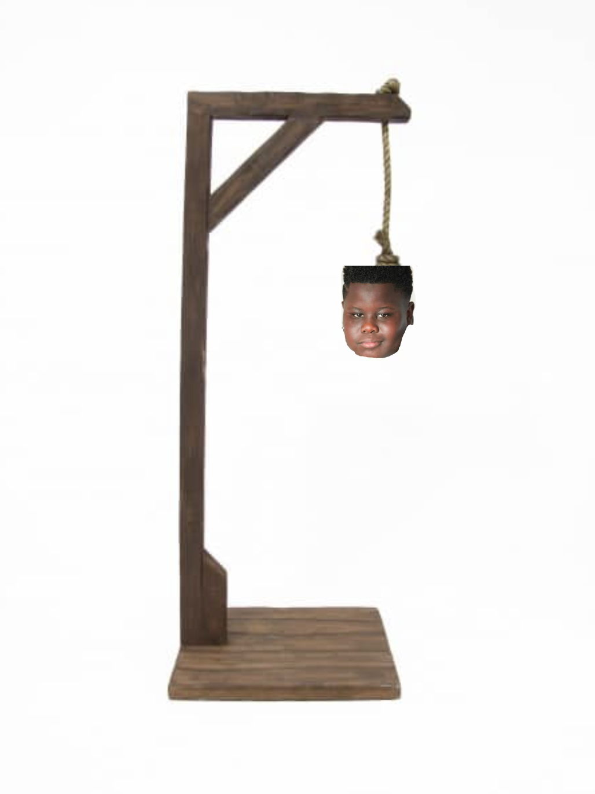

# Galgje

## Te raden woord

|j|a|m|a|l|\
|1|2|3|4|5|

## Score

## Beurten

req1: k
res1: nee helaas
req2: a
res2: ja 2 keer
req3: l
res3: ja 1 keer
req4: m 
res4: ja 1 keer
req5: j
res5: ja 1 keer
res6: je hebt het goed geraden!